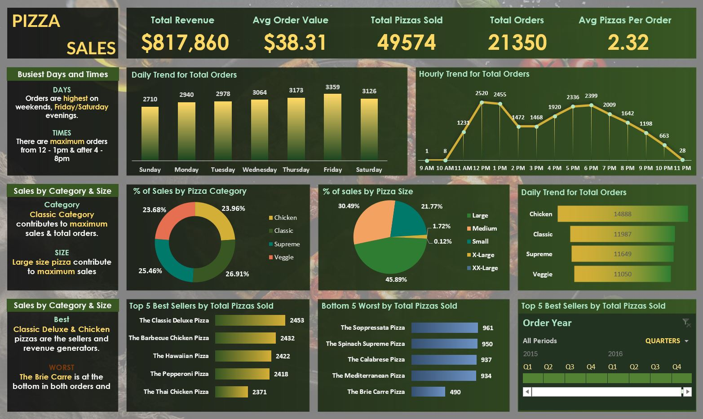

# Pizza Sales Analysis

## Table of Contents

- [Project Overview](#project-overview)
- [Data Sources](#data-sources)
- [Recommendations](#recommendations)

### Project Overview

This data analysis project explores the sales performance of a pizza company using SQL and Excel. By analyzing historical order data across categories, we aim to identify trends in size, time, and product performance to gain a deeper understanding of how the business is doing.



### Data Sources

Sales Data: The main dataset used in this project is the "pizza_sales.csv" file, which includes detailed records of every pizza sale made by the company.

### Tools
- Excel - Data Cleaning 

- SQL Server - Data Analysis

### Data Cleaning/Preparation

In the initial data preparation phase, I encountered several issues that required careful attention before analysis. The following tasks were completed:
1. Loaded the pizza sales data from a CSV file into SQL Server.
2. Identified and resolved formatting issues with the order_date column (inconsistent date formats).
3. Converted date strings to proper DATE format using SQL and Excel.
4. Re-exported cleaned data from Excel to ensure no null values were present.
5. Verified all columns were correctly typed and ready for analysis in Excel.

### Exploratory Data Analysis

EDA involved exploring the sales data to answer key questions, such as:

KPI's Requirement
- Total Revenue
- Average Order Value
- Total Pizzas Sold
- Total Orders
- Average Pizzas Per Order

### Data Analysis

Include some interesting code/features worked with

```sql
SELECT DATENAME (DW, order_date) as order_day, COUNT(DISTINCT order_id) AS Total_orders
FROM pizza_sales_final
GROUP BY DATENAME(DW, order_date);
```

```sql
SELECT pizza_category, SUM(total_price) AS Total_Sales, SUM(total_price) * 100 /
 (SELECT SUM(total_price) FROM pizza_sales_final) AS PCT
FROM pizza_sales_final
GROUP BY pizza_category;

```

```sql
SELECT CAST(CAST(SUM(quantity) AS DECIMAL(10,2)) /
CAST(COUNT(DISTINCT order_id) AS DECIMAL(10,2)) 
AS DECIMAL (10,2))
AS Avg_Pizzas_Per_Order
FROM pizza_sales;
```

### Results/Findings

The analysis results are summarized as follows:
1. Sales tend to peak during weekends and evenings, which suggests higher demand during leisure hours.
2. Large-sized pizzas generate the highest revenue, so they are the most profitable size category.
3. Classic Deluxe and Supreme pizzas are the top-performing products, both in quantity sold and total revenue.
4. The majority of orders occur between 12 PM and 7 PM, making this the ideal window for targeted promotions.
5. Bottom 5 products contribute minimally to overall revenue, so they may be good candidates for removal or rebranding.

### Recommendations

Based on the anlysis, we recommend the following actions:
- Invest in promotions during weekends and evening hours to take advantage of peak sales periods.
- Prioritize large-sized pizzas in marketing and bundling strategies, as they drive the highest revenue.
- Continue promoting top-performing products like the Classic Deluxe and Supreme pizzas to maintain strong sales.
- Evaluate underperforming menu items for potential removal, replacement, or repositioning.
- Align staffing and inventory with high-demand hours (12 PM – 7 PM) to optimize operations and reduce waste.

### Limitations

A major challenge in this project was cleaning the order_date column due to inconsistent and invalid date formats within the dataset. Some entries appeared in regional formats like 13-01-2015, which caused errors during SQL import and prevented proper date conversion. To fix this, I used both Excel and SQL Server in the following steps:

- In Excel, I created a new column next to order_date and used a formula to convert both standard and non-standard date formats to a consistent yyyy-mm-dd format:
  -=IF(ISNUMBER(E2), TEXT(E2, "yyyy-mm-dd"), TEXT(DATE(MID(E2,7,4), MID(E2,4,2), LEFT(E2,2)), "yyyy-mm-dd"))
- After applying the formula to the entire column, I copied the results and pasted them as values into a new column, then deleted the original two.
- I saved this cleaned file as pizza_sales_final.csv and re-imported it into SQL Server.
- During import, I set order_date as nvarchar(50) instead of DATE to avoid conversion errors.
- In SQL Server, I added a new order_date_fixed column, and used TRY_CONVERT() to safely convert the string to a proper DATE format:
```sql
ALTER TABLE pizza_sales ADD order_date_fixed DATE;
UPDATE pizza_sales
SET order_date_fixed = TRY_CONVERT(DATE, order_date);
SELECT COUNT(*) FROM pizza_sales WHERE order_date_fixed IS NULL;
```
- Once confirmed, I replaced the original column with the cleaned one.

While this process resolved the majority of data issues, it's possible that a few improperly formatted values were missed, which could slightly affect time-based insights. This limitation emphasizes the importance of thoroughly inspecting and standardizing raw data before analysis.

### References
1. Data Tutorials – Original project inspiration and dataset walkthrough.
  - [Watch the tutorial](https://www.youtube.com/watch?v=3Acmk-rqn6c&list=PLO9LeSU_vHCWpfLDRTT5nBz9Z0libOs5k&ab_channel=DataTutorials )
  - [Files](https://drive.google.com/drive/folders/1ecpBALfFUMSK-GOnk-X4nZhC_uK18zih)
2. ChatGPT – Used for troubleshooting SQL errors, cleaning strategies, dashboard formatting, and documentation support throughout the project.


